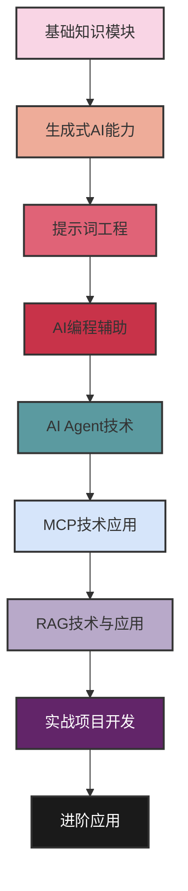
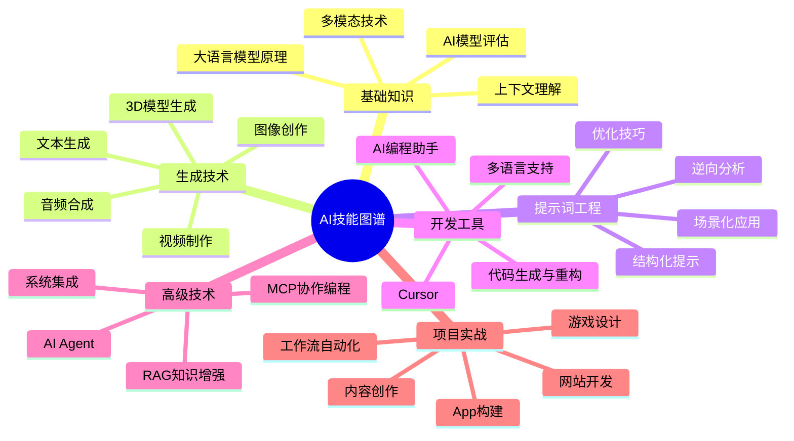
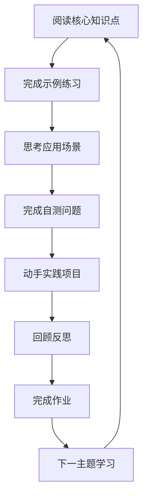

# 自学30天掌握AI开发

## 📚 课程简介

**自学30天掌握AI开发**是一门专为希望通过自学快速掌握AI开发技能的学习者设计的实用课程。这套课程不需要导师指导，完全可以按照自己的节奏独立完成。通过精心设计的30天学习路径，你将从AI小白成长为能够利用AI工具高效工作、独立开发项目的AI应用专家。

每天的学习内容都包含明确的学习目标、核心知识点讲解、详细的学习内容、代码示例、自测问题、拓展资源和实践项目，确保你在自学过程中能够循序渐进、有的放矢。

无论你是希望提升工作效率的职场人士，还是想探索AI创新应用的创业者，本自学课程都将为你提供清晰的学习路径和实用的技能培训。从理解大语言模型的基本原理，到熟练使用AI Agent开发应用，我们的课程设计满足自学者需求，强调实践与应用。

> *"自学成才，让AI成为你的得力助手和创新伙伴"*

## 🧭 自学指引

本课程专为自学者设计，具有以下特点：

- **完全自主学习**：无需导师指导，按照自己的节奏学习
- **步骤详尽**：每个知识点和练习都有详细说明和操作步骤
- **即学即用**：每天都能学到可以立即应用的实用技能
- **答案内置**：自测题和前一天作业都提供详细解答
- **资源丰富**：精选学习资料和工具，无需花时间搜索
- **交互性强**：通过动手实践加深理解和记忆
- **进度可控**：可以根据个人情况调整学习速度和深度

## 🗺️ 学习路线图

## 🎯 课程目标

完成本课程后，你将能够：

- ✅ 理解大语言模型工作原理及其局限性
- ✅ 熟练掌握提示词工程，提高AI输出质量
- ✅ 使用AI工具进行创意内容生成（文本、图像、视频等）
- ✅ 利用AI编程助手显著提升开发效率
- ✅ 构建和定制AI Agent解决复杂任务
- ✅ 应用MCP和RAG技术进行高级AI开发
- ✅ 独立完成AI驱动的应用程序开发
- ✅ 将AI技术融入工作流程，提高生产力

## 🧠 技能图谱

## 📋 课程内容

### 模块一：基础知识模块
- 人工智能与大语言模型基本概念
- 大模型工作原理与特点
- 上下文长度与理解能力
- 多模态AI技术
- AI模型评估标准与市场排名

### 模块二：生成式AI能力
- 文本生成与对话系统
- AI绘画与图像生成
- AI视频创作
- AI音频生成
- 3D模型与场景生成

### 模块三：提示词工程
- 提示词结构与组成元素
- 有效提示词编写方法论
- 场景化提示词策略
- 提示词优化技术
- 逆向工程分析优质提示词

### 模块四：AI编程辅助
- Cursor等AI编程工具使用
- 代码生成与自动补全
- 代码解释与重构
- 调试与问题解决
- 多语言编程支持

### 模块五：AI Agent技术
- Agent概念与工作原理
- 自动化工作流程构建
- 多Agent协作系统
- Agent定制与优化
- 任务规划与执行

### 模块六：MCP技术应用
- 多智能体协作编程基础
- MCP工具链使用方法
- 大型项目中的MCP应用
- MCP效率优化
- 协作开发流程

### 模块七：RAG技术与应用
- 检索增强生成原理
- 知识库构建方法
- 向量数据库应用
- 自定义RAG系统开发
- RAG在专业领域的应用

### 模块八：实战项目开发
- 网站开发自动化
- 移动应用设计与开发
- 游戏设计与实现
- 视频内容创作与编辑
- 自动化工作流构建

### 模块九：进阶应用
- AI系统集成
- 云服务与API调用
- 大规模项目管理
- 性能优化与调优
- 商业应用与变现模式

## 📈 学习进度

```mermaid
gantt
    title 30天学习进度安排
    dateFormat  DD
    axisFormat %d
    
    section 基础学习
    基础知识模块    :a1, 01, 3d
    生成式AI能力    :a2, after a1, 3d
    提示词工程      :a3, after a2, 4d
    
    section 工具学习
    AI编程辅助      :b1, after a3, 3d
    AI Agent技术    :b2, after b1, 3d
    MCP技术应用     :b3, after b2, 2d
    RAG技术与应用   :b4, after b3, 2d
    
    section 实战项目
    项目开发        :c1, after b4, 6d
    进阶应用        :c2, after c1, 4d
```

## 🛠️ 技术栈覆盖

| 类别 | 包含技术 |
|------|---------|
| **AI模型** | GPT-4, Claude, Gemini, LLaMA等 |
| **图像生成** | Midjourney, DALL-E, Stable Diffusion |
| **视频生成** | Runway, Pika, Sora(原理) |
| **开发工具** | Cursor, VSCode, GitHub Copilot |
| **Agent平台** | AutoGPT, LangChain, BabyAGI |
| **MCP工具** | Multi-Agent协作框架 |
| **RAG技术** | Pinecone, Weaviate, LlamaIndex |
| **开发语言** | Python, JavaScript, HTML/CSS |
| **项目类型** | Web应用, 移动App, 游戏, 创意内容 |

## 💡 教学方法

本课程采用"理论+实践+项目"三位一体的教学方法：

1. **微理论**: 每个概念讲解控制在15分钟内，重点突出实用性
2. **随堂实践**: 每个知识点配套上手练习，强化技能掌握
3. **项目驱动**: 贯穿全课程的实战项目，将所学知识整合应用
4. **资源共享**: 提供丰富的AI工具资源、提示词模板和代码示例

## 👨‍🎓 适合人群

- 有基础编程知识但希望借助AI提升效率的开发者
- 想要使用AI工具创建应用、网站、游戏的创作者
- 对AI领域感兴趣但不知从何开始的初学者
- 希望将AI技术融入工作流程的职场人士
- 想要了解AI最新发展并探索应用可能性的学习者

## 📊 学习成果展示

完成课程后，学员将能够独立完成以下类型的项目：

- 基于AI的个人助手应用
- 智能内容生成网站
- AI驱动的简单游戏
- 自动化内容创作工作流
- 个性化AI知识库系统

## 🔍 为什么选择本课程

- **零门槛**: 不需要深厚的编程基础，循序渐进学习
- **实用性**: 直接面向实际应用，不纠结于过多理论
- **前沿性**: 覆盖AI领域最新技术和应用方向
- **系统性**: 从基础概念到实战项目的完整学习体系
- **可扩展**: 提供进阶学习路径，持续成长

## 🚀 立即开始您的AI学习之旅！

加入我们，30天从AI小白到AI应用专家！

---

*注：本课程内容会根据AI技术的发展定期更新，确保学习内容的前沿性和实用性。*

## 课程特点

**自学30天掌握AI开发**是一门专为希望快速入门并掌握AI开发技能的学习者设计的实用课程。无论你是完全的编程新手，还是已有一定基础的开发者，本课程都能满足你的学习需求。

## 📋 自学时间规划

根据不同学习者的时间和精力，我们提供三种学习计划：

| 学习计划 | 每日时间投入 | 完成周期 | 适合人群 |
|---------|------------|---------|---------|
| **标准计划** | 2-3小时/天 | 30天 | 有一定空闲时间，想快速掌握AI技能的学习者 |
| **轻松计划** | 1-2小时/天 | 45-60天 | 工作繁忙，只能利用碎片时间学习的职场人士 |
| **强化计划** | 4-6小时/天 | 15-20天 | 全职学习或假期专攻，希望密集学习的人群 |

**每日时间分配建议**：
- 理论学习：30-40%
- 动手实践：40-50%
- 作业思考：20-30%

## 🔄 自学循环模式

我们建议采用以下学习循环，以最大化自学效果：

**每周进行一次总复习，确保知识点连贯理解，避免遗忘。**

最重要的是，记住自学是一段个人成长的旅程，允许自己犯错、反思、调整和成长。坚持每天学习，相信在30天后，你将拥有令人惊叹的AI开发能力！ 

---

> 点击链接加入群聊【Aries - AIGC自学交流群】：https://qm.qq.com/q/q88ZpofKLY

